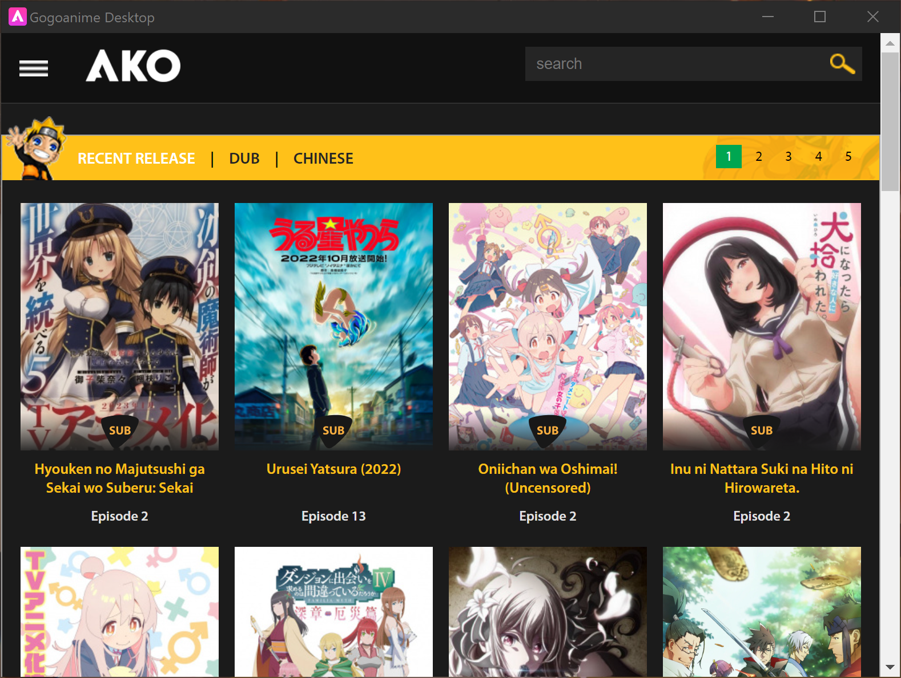

<h1 align="center"></h1>

  

&nbsp; 

|
Hey~	♡ I am Ako! &nbsp;&nbsp; ** ** an Electron project that turns gogoanime ** ** into a desktop app!
  |  |
|--|--|
&nbsp;

---
&nbsp;

**About**
&nbsp;

What is this project exactly?

This is a electron based desktop app that turns gogoanime into a desktop app 
without all those silly ads and trackers because who needs those right? :wink:

**Features**
&nbsp;

- Ad Blocking
- Discord RPC support
- Persistance (so you can pickup where you left off)
  
&nbsp;

<h3 align="left"></h3>

---
&nbsp;

**FAQ**
&nbsp;

- I See a white screen what do I do? 
> this usally means that the host site is down 
> you may have to try again later :(
&nbsp;
- I Found a Ad what do I do?
> While this project aims to be adless it isnt perfect 
> If you find a ad the best thing you can do is note down the ad
> and report it it seems to sometimes bypass the filter by being in 
> in the video embed though its a rare situation :(

**Current known issues include:**

- A slight delay when updating DiscordRPC
- DiscordRPC stuck on watching while searching for anime
- Scroll bar is not hidden (when hidden stops scrolling ;-;)

---

**TODOS:**

- hide scrollbar without ruining app
<h3 align="left"></h3>

&nbsp; 

<a href='https://ko-fi.com/zoeebun' target='_blank'>

